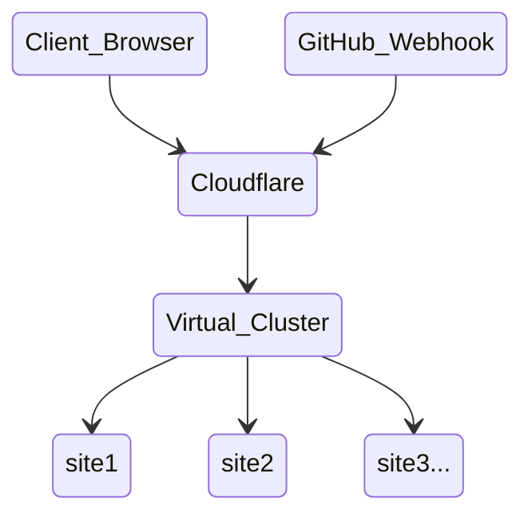
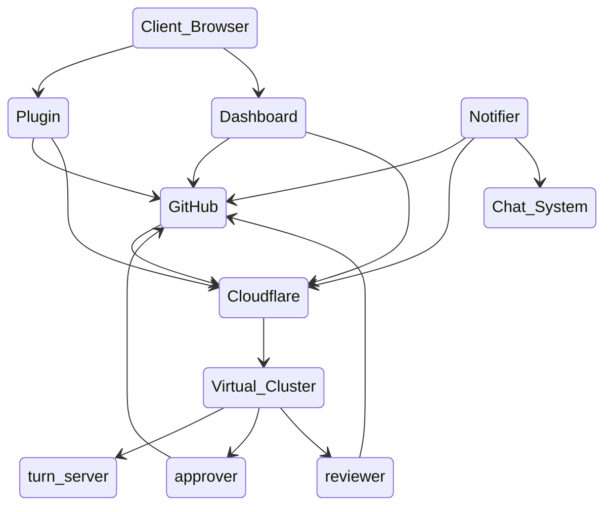

# Ready To Review Systems Architecture

## Network

Ready To Review operates with a Zero Trust network infrastructure.

## Data Flow

Where possible, clients pull all data directly from GitHub -- so that we don't have to store sensitive data. No customer data is persisted to disk.

## Virtual Cluster

Similar to Netflix's architecture, our Virtual Cluster is made up of distributed nodes running FreeBSD 15.0-CURRENT, a highly performant and relatively secure environment. The host itself is extremely minimalist with no 3rd party packages installed. These nodes only exist to run isolated verifiable workloads.

### V1

Jail-based isolation with locally built binaries. Kind of lame.

### V2

Isolated workloads using bhyve VMs and a nano kernel. manager binary rebuilds binaries nightly via a builder jail. Firewall only allows access to VMs from Cloudflare.
